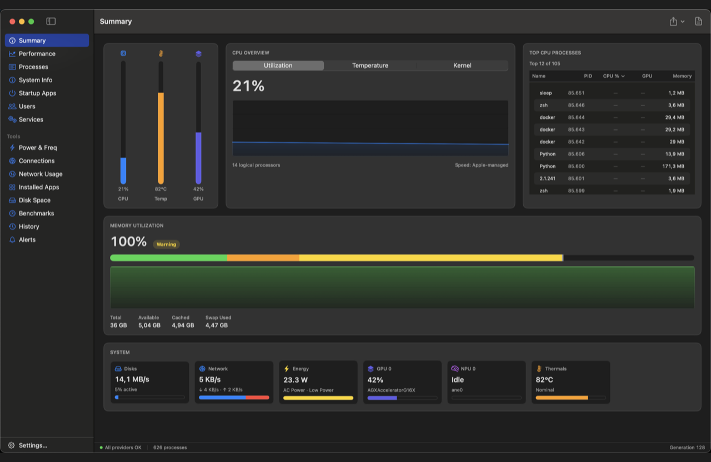
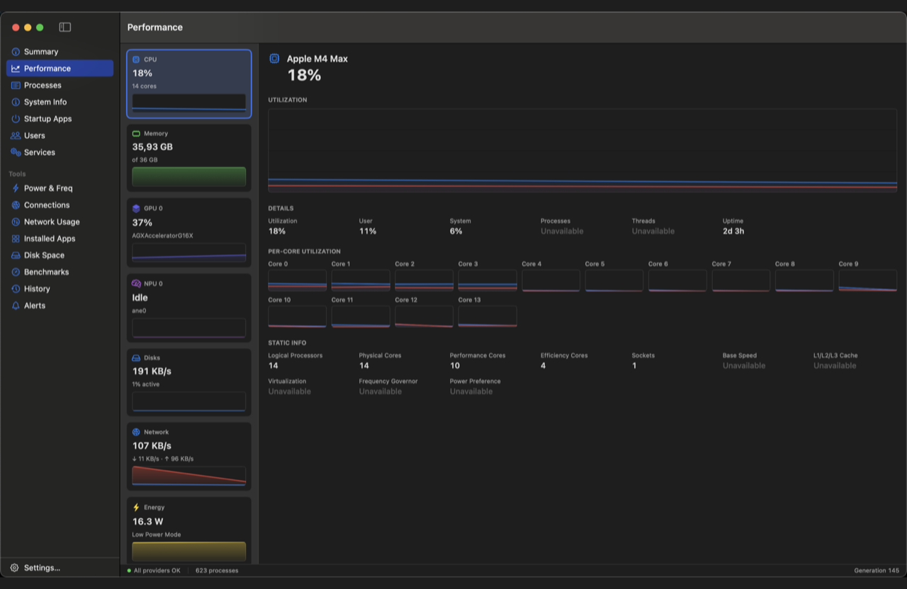
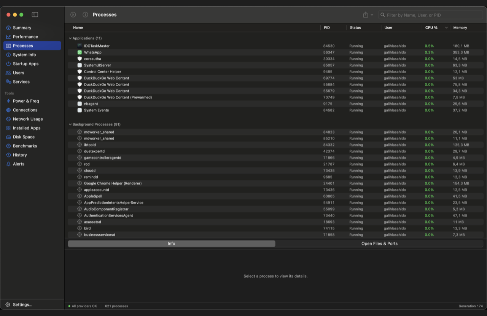
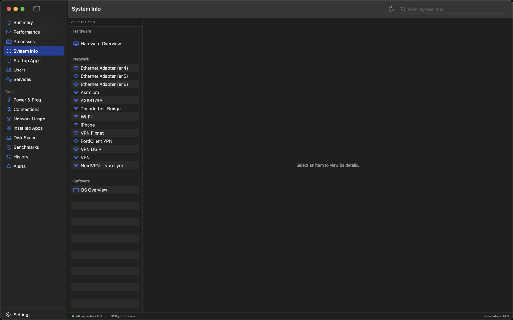
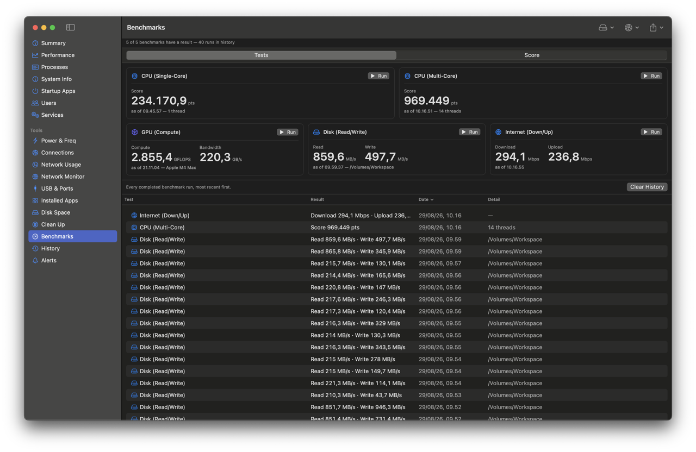
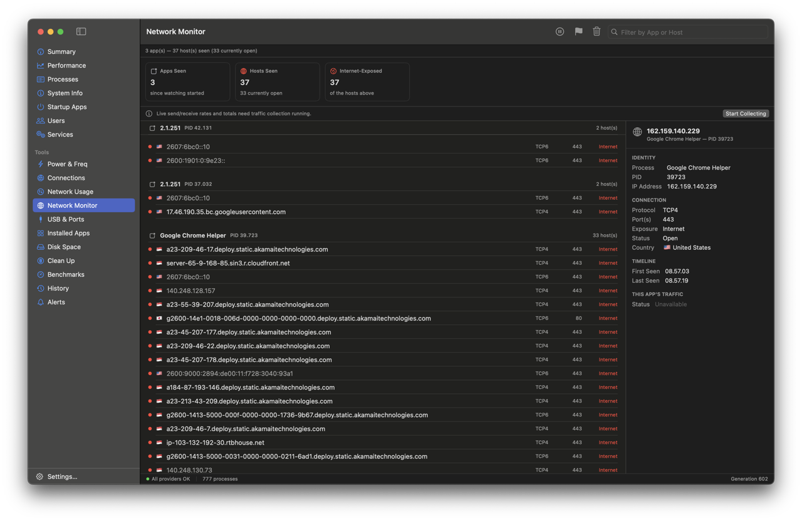
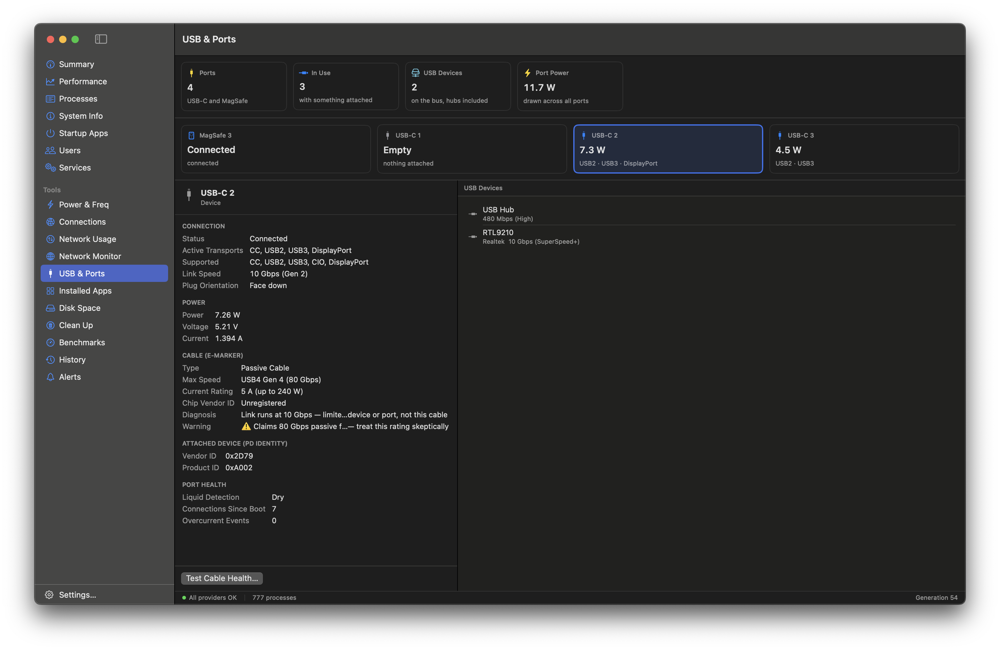

# IDOTaskMaster

[](https://paypal.me/abahido)
[](https://lynk.id/abahido/s/z52m3ekew032)

A native macOS system monitor / task manager with a deep, power-user feature set,
presented in **Activity Monitor's native visual language** — SF Pro, standard controls,
subtle filled-area graphs, correct light & dark appearance. No neon, no custom fonts,
no upsells: every page is unlocked, free.

Built with SwiftUI + AppKit interop + Canvas drawing, reading live metrics straight from
`host_processor_info`, `vm_statistics64`, libproc, IOKit, and friends — no helper daemons,
no IPC. Providers that can't read a metric say **"Unavailable"** instead of guessing.



## Features

**Live monitoring**
- **Summary** — dashboard with CPU/Temp/GPU capacity towers, a tabbed CPU Overview graph
  (Utilization / Temperature / Kernel), top CPU processes, memory utilization band, and a
  tile grid for Disks / Network / Energy / GPU / NPU / Thermals.
- **Performance** — master-detail page with a live sparkline rail (CPU, Memory, GPU, NPU,
  Disks, Network, Energy, Thermals) and rich per-domain detail: per-core CPU graphs, GPU
  Overall/Engines tabs, disk & network throughput, battery/power state, per-die thermal
  sensors.
- **Processes** and **Users** — grouped Applications/Background process tree with a full
  identity/lifetime/processor/memory/disk detail pane; per-user rollups.
- **System Info** — a `system_profiler`-style Hardware / Network / Software catalog with
  key-value detail and Reload.
- **Startup Apps** and **Services** — LaunchAgent/Daemon and `launchctl` listings with
  enable/disable and detail panes.

**Power-user tools** (free, no license required)
- **Power & Freq** — an HWiNFO-style live sensor tree (Value/Min/Max) for CPU/GPU/SSD.
- **Connections** — per-process socket table with exposure classification
  (loopback/LAN/Internet) and filter chips.
- **Network Monitor** — a persistent outbound-connection log: which apps talked to which
  hosts and when, with app icons, opt-in per-host country lookup, and a New Outbound Host
  alert rule.
- **USB & Ports** — every physical USB-C/MagSafe port with live volts/amps/watts, the
  attached cable's e-marker identity, the negotiated link speed with a
  cable-vs-device diagnosis, port health (liquid detection, fault counters), the USB
  device tree, and an explicit cable-health test that catches marginal cables a link
  rate can't show.
- **Installed Apps** — `/Applications` scan with sizes, related-files finder, and Uninstall.
- **Disk Space** — async scanner, bubble visualization, file-type legend, largest
  folders/files.
- **Clean Up** — clear app caches, logs, and developer-tool build output, with everything
  routed through the Trash.
- **Benchmarks** — CPU (single/multi-core), GPU compute, Disk R/W (with a target-disk
  picker), Internet down/up (with a network-interface picker), plus an aggregate Score
  page with run history.

**Extras**
- Menu bar extra with a live compact readout and popover mini-dashboard (keeps collecting
  with the main window closed).
- Dock icon live graph.
- Alert rules (CPU/memory/disk/battery/new listening port thresholds) → native
  notifications.
- Persistent history (SQLite) with 24h/7d charts per domain.
- Per-process network traffic (Network Usage page).
- Extended process actions: suspend/resume, renice, kill tree, Open Files & Ports,
  code-signing status.
- ⌘K command palette, CSV/JSON export, one-click system snapshot report, battery health
  trend.

## Screenshots

| Performance | Processes |
|---|---|
|  |  |

| System Info | Benchmarks |
|---|---|
|  |  |

| Network Monitor | USB & Ports |
|---|---|
|  |  |

## Requirements

- macOS 13.0 or later (Apple silicon is the primary target; Intel is best-effort).
- Xcode 15 or later to build.
- [XcodeGen](https://github.com/yonaskolb/XcodeGen) only if `IDOTaskMaster.xcodeproj`
  needs to be regenerated from `project.yml` (e.g. a fresh clone before the project file
  exists) — `brew install xcodegen`. The committed `.xcodeproj` is normally enough on its
  own.

## Building & running

All common tasks are one-line scripts in `scripts/` (see each file's header for details):

```sh
scripts/run.sh        # build (Debug) and launch, like a normal double-click
scripts/debug.sh       # build (Debug) and run under lldb — prints/NSLog stream here
scripts/build.sh       # just compile: scripts/build.sh [Debug|Release]
```

Or open `IDOTaskMaster.xcodeproj` in Xcode and hit Run — same target either way.

Some data (SMC sensors, other users' processes, full connection info) may be restricted
by macOS permissions; affected providers degrade gracefully instead of failing outright.

## Packaging for distribution

```sh
scripts/release.sh     # optimized Release build -> dist/IDOTaskMaster.app
scripts/dmg.sh          # -> dist/IDOTaskMaster-<version>.dmg (Finder drag-to-Applications)
scripts/pkg.sh          # -> dist/IDOTaskMaster-<version>.pkg (double-click installer)
```

`dmg.sh` and `pkg.sh` build a Release copy first if `dist/IDOTaskMaster.app` doesn't exist
yet. Builds are ad-hoc/unsigned by default, which is fine for running on the machine that
built them. To produce a properly signed build — required before notarizing or sharing
with another Mac under Gatekeeper — pass your Apple Developer Team ID:

```sh
DEVELOPMENT_TEAM=ABCDE12345 scripts/release.sh
INSTALLER_SIGN_IDENTITY="Developer ID Installer: Your Name (TEAMID)" scripts/pkg.sh
```

## Project structure

```
IDOTaskMaster/
├─ App/           # @main, window/menu/shortcut chrome, menu bar extra, Dock icon, settings
├─ Core/          # Sampler tick loop, Snapshot model, in-memory + SQLite history, alerts
├─ Providers/     # one type per metric domain (CPU, Memory, GPU, Disk, Network, …)
├─ Benchmarks/    # CPU/GPU/Disk/Internet benchmark runners
├─ Components/    # HistoryGraph, CapacityBar, DataTable, StatTile, DetailPane, Exporter…
├─ Pages/         # one SwiftUI view per sidebar page
└─ Theme/         # per-domain color tokens (macOS palette)
```

## Status

Feature-complete: every monitoring page, power-user tool, alert/history system, menu bar
extra, Dock icon, and the MCP server below are implemented.

## MCP Server

`IDOTaskMasterMCP` is a second, standalone command-line target — a
[Model Context Protocol](https://modelcontextprotocol.io) **server** that lets an AI
assistant (Claude Code, Claude Desktop, or any MCP client) query this Mac's live
system-monitoring data over stdio, the same data the GUI app collects. It reuses
`Core/`/`Providers/` directly (xcodegen compiles those same source folders into both
targets — see `project.yml`), so its readings come from the exact same
`host_processor_info`/`vm_statistics64`/IOKit/libproc code paths as the GUI app, not a
reimplementation.

**Read-only, full stop.** Every tool below maps to a `sample()`/query call — never a
write method. Nothing here can kill/suspend/renice a process, run a benchmark, toggle a
startup item, uninstall an app, or otherwise change anything on this Mac.

**Tools**

| Tool | What it returns |
|---|---|
| `get_summary` | One-shot CPU/memory/GPU/disk/network/energy/thermal/NPU snapshot + process count |
| `list_processes` | Every running process (name/user filter, limit) |
| `get_top_processes` | Summary dashboard's "Top CPU processes" table |
| `get_process_detail` | One PID's full detail + code-signing status + open files/sockets |
| `get_system_info` | Hardware/Network/Software catalog (`system_profiler`-backed) |
| `list_startup_items` | LaunchAgents/LaunchDaemons on disk + live launchctl state |
| `list_services` | Every job `launchctl print` currently knows about |
| `list_connections` | Per-process open sockets, with loopback/LAN/internet exposure |
| `list_installed_apps` | `/Applications` scan: name, version, publisher, size |
| `list_history_series` | Which (domain, key) time series this Mac has recorded |
| `query_history` | 24h/7d history for one (domain, key) pair |
| `list_alert_rules` | The GUI app's configured alert rules (not fired-alert history) |

`list_history_series`/`query_history` read the same
`~/Library/Application Support/IDOTaskMaster/History.sqlite` file the GUI app's own
history recorder writes to (they only query it — never `.start()` a second recorder
against it), so they return real data only once the GUI app has run at least once.
Likewise `list_alert_rules` reads the GUI app's own `UserDefaults`-persisted rules.

**Building**

```sh
scripts/build-mcp.sh            # Debug (default)
scripts/build-mcp.sh Release
```

Produces a plain executable at `.build/Build/Products/<Debug|Release>/IDOTaskMasterMCP`
(no app bundle — it's a command-line tool, not a GUI target).

**Registering with an MCP client**

For Claude Code, from this repo (adjust the path to wherever you built the binary):

```sh
claude mcp add idotaskmaster -- /absolute/path/to/IDOTaskMasterMCP
```

For Claude Desktop or any other MCP client that reads a JSON config, add an entry like:

```json
{
  "mcpServers": {
    "idotaskmaster": {
      "command": "/absolute/path/to/IDOTaskMasterMCP"
    }
  }
}
```

## Support

IDOTaskMaster is free, open source, and will stay that way — no license keys, no
paywalled pages, no ads. If it's saved you a trip to Activity Monitor often enough
to be worth a coffee, a small contribution goes a long way toward keeping it built
and maintained:

[](https://paypal.me/abahido)
[](https://lynk.id/abahido/s/z52m3ekew032)

Not able to contribute? Starring the repo, filing an issue, or just telling another
Mac user about it helps just as much. Thank you either way. 🙏

Questions, feedback, or anything else — reach me at
[galih.lasahido@gmail.com](mailto:galih.lasahido@gmail.com).

## License

Apache License 2.0 — see [LICENSE](LICENSE).
